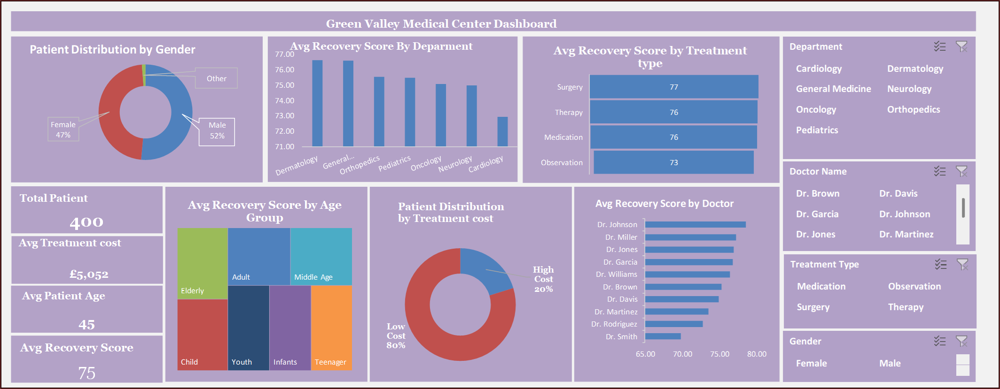

# Green Valley Medical Centre — Excel Healthcare Analytics

An Excel healthcare analytics project covering patient recovery, treatment cost and demographic patterns across **400 patients**.

[View the supporting project](https://mayfuns.github.io/mariam-analytics-portfolio/supporting-projects.html#green-valley)



## Headline metrics

| KPI | Result |
| --- | ---: |
| Patients | **400** |
| Average recovery | **75** |
| Average treatment cost | **5,052** |
| Average age | **45** |

## Excel workbook

[Open the original Green Valley Excel workbook](02_excel/Green%20Valley%20Excel%20Analysis.xlsx)

The repository now includes the original analysis workbook alongside the exported dashboard, so the underlying Excel project can be reviewed directly.

## Tools and skills

- Microsoft Excel
- Pivot tables / summary analysis
- Healthcare analytics
- KPI reporting
- Dashboard design
- Data visualisation

## Repository structure

```text
01_dashboard/
02_excel/
03_data/
04_documentation/
```

## Portfolio

- [Portfolio homepage](https://mayfuns.github.io/mariam-analytics-portfolio/)
- [Supporting projects](https://mayfuns.github.io/mariam-analytics-portfolio/supporting-projects.html#green-valley)
